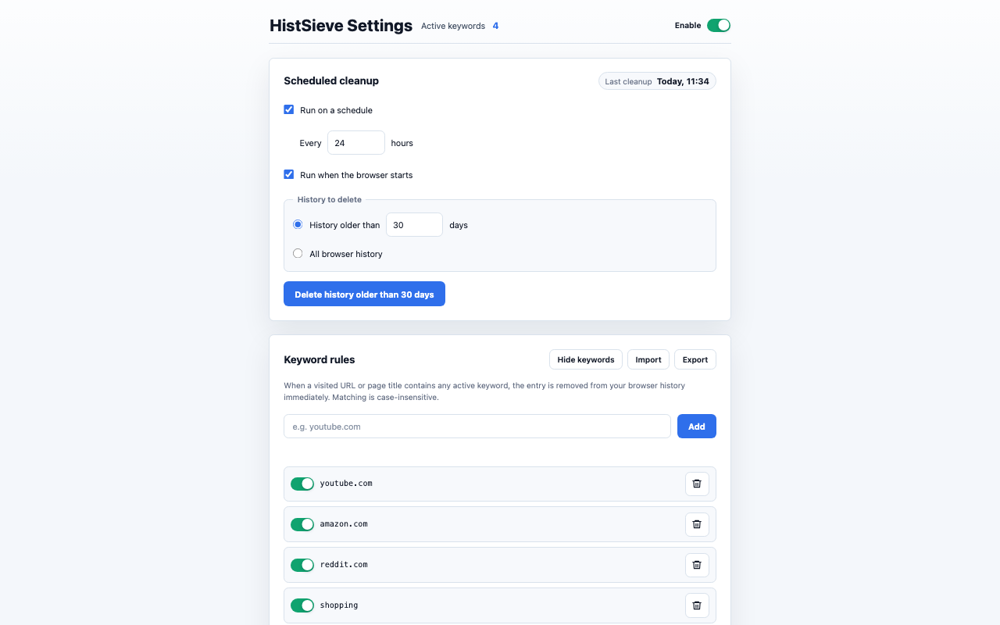

# HistSieve

HistSieve is a Chrome extension for cleaning browser history from rules you control.



## Features

- Delete matching history entries immediately after a visit.
- Match active keywords against the page URL and title, case-insensitively.
- Enable or disable individual keyword rules without deleting them.
- Run cleanup manually from the toolbar popup or the settings page.
- Run scheduled cleanup by interval.
- Run cleanup when Chrome starts.
- Delete either all history or entries older than a configured number of days.
- Import and export keyword rules as JSON.
- English and Simplified Chinese UI.
- Automatic light and dark theme that follows the system setting.

## Privacy Model

HistSieve processes browser history locally in Chrome. It does not send browsing
history, keywords, settings, or cleanup results to any server.

Keyword rules and cleanup settings are stored with `chrome.storage.local`.

See [PRIVACY.md](./PRIVACY.md) for the full privacy statement.

## Permissions

- `history`: read and delete browser history entries according to the user's rules.
- `alarms`: schedule recurring cleanup.
- `storage`: save settings and keyword rules locally.

HistSieve does not request host permissions.

## Local Development

Requires Node.js 20+ and pnpm 9+. If pnpm is missing, run `corepack enable`.

```bash
pnpm install
pnpm dev          # build with watch mode for local Chrome reloads
pnpm test
pnpm typecheck
pnpm build
```

Load the extension from `dist` in `chrome://extensions` with Developer Mode enabled.

## Release Build

```bash
pnpm assets:store
pnpm build:release
```

`pnpm assets:store` renders product screenshots with local Chrome and uses `sips`
for icon PNGs. Set `CHROME_PATH` if Chrome is not installed in the default location.

The upload package is generated under `release/`.

## Manual Test Checklist

1. Build the extension with `pnpm build`.
2. Load `dist` as an unpacked extension in Chrome.
3. Open the options page and add a keyword such as `example.com`.
4. Visit a matching URL and confirm it is removed from Chrome history.
5. Use the popup or options page to run cleanup manually.
6. Toggle scheduled cleanup and confirm settings persist after reopening Chrome.
7. Export keywords, remove them, import the file, and confirm the list is restored.

## License

[MIT](./LICENSE).
